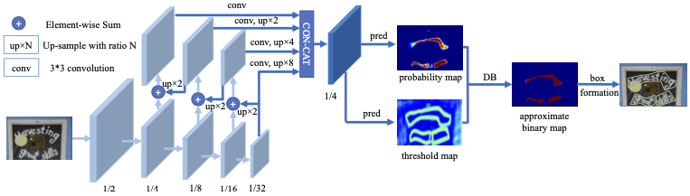
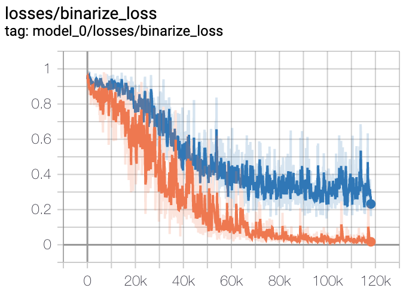
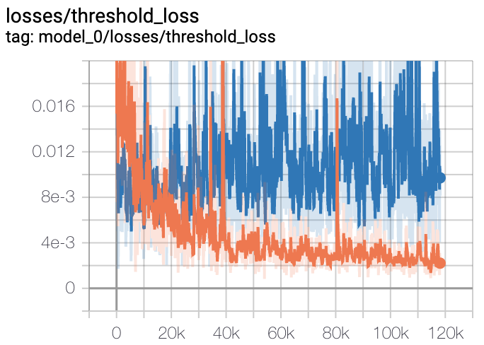
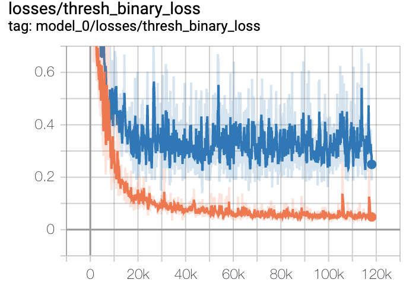
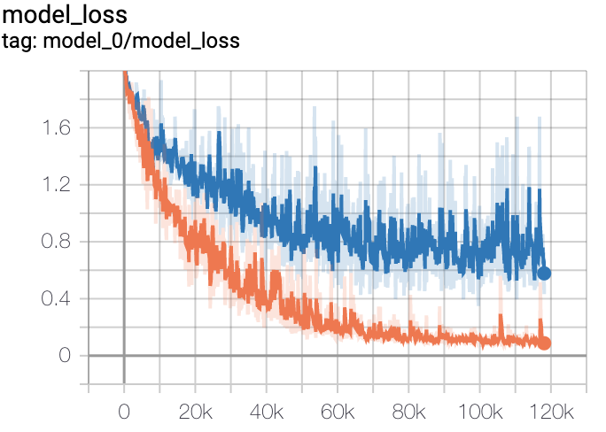
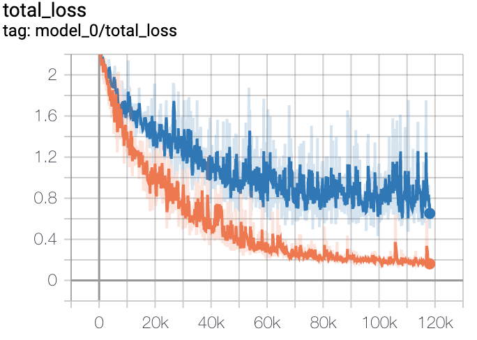
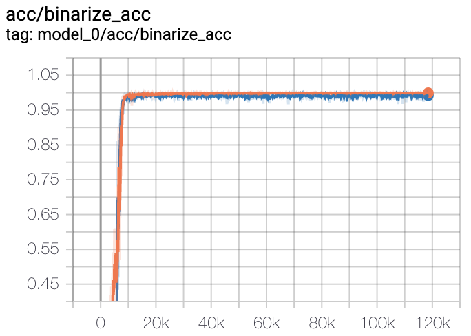

# DB: Real-time Scene Text Detection with Differentiable Binarization

## Introduction
This is a TensorFlow implementation of ["Real-time Scene Text Detection with Differentiable Binarization"](https://arxiv.org/abs/1911.08947).

Part of the code is inherited from [DB](https://github.com/MhLiao/DB).

## Requirements:
- Python3
- Tensorflow >= 1.13 
- easydict

## Dataset
This repo is train on CTW1500 dataset.
Download from [BaiduYun](https://pan.baidu.com/s/1yG_191LemrQa7K0h7Wispw) (key:yjiz) or 
[OneDrive](https://1drv.ms/u/s!Aplwt7jiPGKilH4XzZPoKrO7Aulk).

## Test

### 1.Download model.

| Model 	| BaiduYun 	| GoogleDrive 	|
|------------	|-------	|-------	|
| ResNet-50| [BaiduYun](https://pan.baidu.com/s/1Pfwl8M6aBwuUpJbP2jVFuw)| [GoogleDrive](https://drive.google.com/drive/folders/1uJL6sf6EP6ekK_4XLNGLt1U9EGRJ0eDO?usp=sharing)|

### 2.Config network
revise the `db_config.py`

    cfg.BACKBONE = 'resnet_v1_50'

### 3.Start to test img.

    python inference.py --gpuid='0' --ckptpath='path' --imgpath='img.jpg'

## Samples show

| org show 	| poly show 	| bbox show 	|
|------------	|-------	|-------	|
|  	|  	|  	|
| binarize_map |  threshold_map	| thresh_binary |
|  |  	|  | 

## Training model
#### 1. Get the CTW1500 train images path and labels path.

revise the `db_config.py`
    
    # Train data config
    cfg.TRAIN.IMG_DIR = '/path/ctw1500/train/text_image'
    cfg.TRAIN.LABEL_DIR = '/path/ctw1500/train/text_label_curve'
    
    # Val or test data config
    cfg.EVAL.IMG_DIR = '/path/ctw1500/test/text_image'
    cfg.EVAL.LABEL_DIR = '/path/ctw1500/test/text_label_circum'
    
    
#### 2. Muti gpu train and config network.

revise the `db_config.py`
    
    # only support 'resnet_v1_50' and 'resnet_v1_18'
    cfg.BACKBONE = 'resnet_v1_50' 
    cfg.TRAIN.VIS_GPU = '5,6' # single gpu -> '0'
    
#### 3. Save train logs and models.

revise the `db_config.py`

    cfg.TRAIN.TRAIN_LOGS = '/path/tf_logs'
    cfg.TRAIN.CHECKPOINTS_OUTPUT_DIR = '/path/ckpt'
    
#### 4. Pretrain or restore model.

If you want to pretrain model,

revise the `db_config.py`

    cfg.TRAIN.RESTORE = False
    cfg.TRAIN.PRETRAINED_MODEL_PATH = 'pretrain model path'
    
If you want to restore model,

revise the `db_config.py`

    cfg.TRAIN.RESTORE = True
    cfg.TRAIN.RESTORE_CKPT_PATH = 'checkpoint path'

#### 5. Start to train.

    python train.py

### 6. Tensorboard show
    
    cd 'tensorboard path'
    tensorboard --logdir=./

Red line is train logs, blue line is val logs.

Losses show

|   binarize loss	|   threshold loss	|threshold binary loss	|
|------------	|-------	|-------	|
|  	| 	|	|
|   model_loss 	|   total_loss	|	|
|  	|  	| |

Acc show

|   binarize acc	|   threshold binary acc	|
|------------	|-------	|
|  	| 	|

## Experiment

Test on RTX 2080 Ti.

|   BackBone	|   Input Size	|   Infernce Time(ms)	|	PostProcess Time(ms) | FPS |
|------------	|-------	|-------	|-------	|-------	|
| ResNet-50 	| 320	| 13.3 | 2.9 | 61.7 |
| ResNet-50 	| 512	| 19.2 | 4.5 | 42.2 |
| ResNet-50 	| 736	| 33.2 | 5.7 | 25.7 |
| ResNet-18 	| 320	|  12.2 | 2.9 | 66.2 |
| ResNet-18 	| 512	| 16.9 | 4.5 | 46.7 |
| ResNet-18 	| 736	| 32.7 | 5.7 | 26 |

## ToDo List

- [x] Release trained models
- [x] Training code
- [x] Inference code
- [x] Muti gpu training
- [x] Tensorboard support
- [x] Exp another train losses 
- [ ] Eval code
- [x] Data augmentation(crop and random img aug)
- [x] More backbones
- [ ] Add dilation conv
- [ ] Deformable Convolutional Networks
